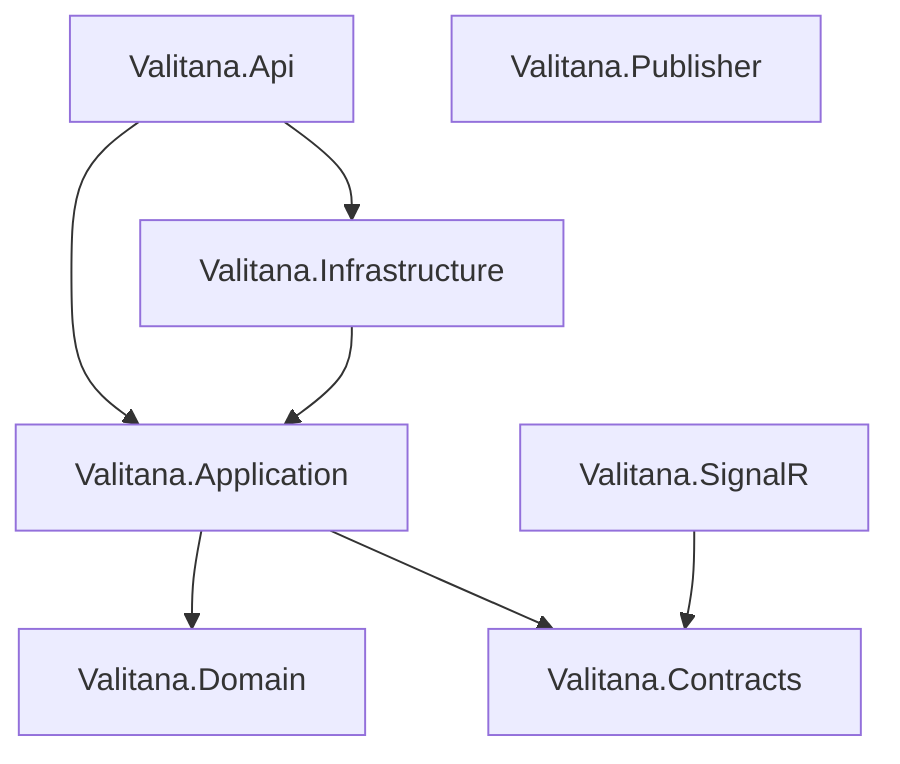
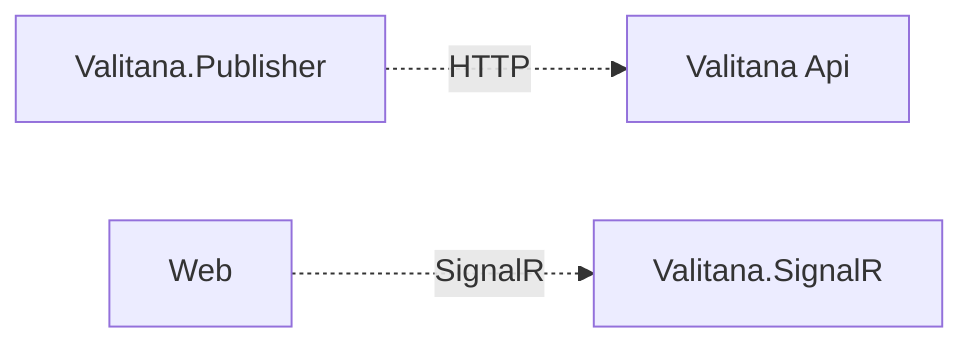

# Valitana

Playground that streams fake stock prices to a live chart.

The publisher posts prices to the API. The API raises a domain event, then publishes to RabbitMQ. The SignalR service consumes that message and pushes it to a Vue chart.

## Project references

Which .NET projects reference which. Arrows point to the project being referenced. Publisher has no project references.



## Runtime connections

Publisher talks to Valitana Api over HTTP. The Vue app talks to Valitana.SignalR. Dotted arrows are those calls, not project references. Valitana Api is the graph above.



## Projects

- **Valitana.Api** — HTTP endpoint that accepts price updates.
- **Valitana.Application** — Commands and handlers that record a new price.
- **Valitana.Infrastructure** — EF Core in-memory database and RabbitMQ publisher.
- **Valitana.Domain** — Stock aggregate and domain events.
- **Valitana.Contracts** — Shared messages for RabbitMQ and SignalR.
- **Valitana.SignalR** — Pushes price updates to the browser.
- **Valitana.Publisher** — Posts fake prices to the API.
- **Web** — Vue chart of live prices (`frontend`).

## Testing

Unit tests cover Domain, Application, and the outbox mapper. Architecture tests stay separate and do not collect coverage.

```bash
dotnet test backend/tests/Valitana.UnitTests --collect "XPlat Code Coverage" --settings backend/tests/coverlet.runsettings
dotnet tool restore
dotnet reportgenerator -reports:backend/tests/Valitana.UnitTests/TestResults/**/coverage.cobertura.xml -targetdir:coverage -reporttypes:"Html;TextSummary"
```

Open `coverage/index.html` for the HTML report.

## Run

```bash
docker compose up --build
```

Open [http://localhost:8080](http://localhost:8080).

| Service  | Port  |
|----------|-------|
| Web      | 8080  |
| API      | 5000  |
| SignalR  | 5001  |
| RabbitMQ | 15672 |
